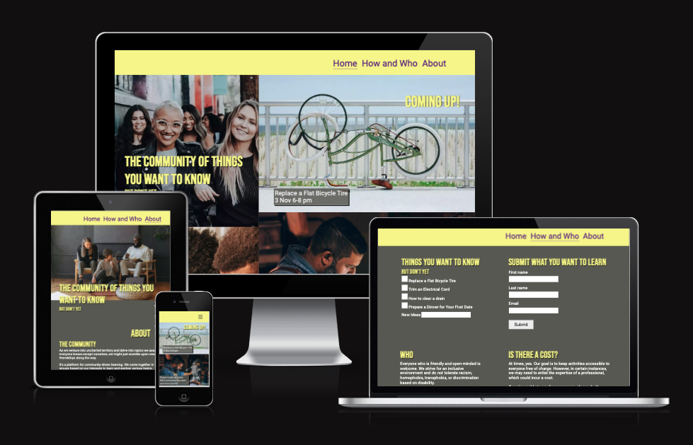
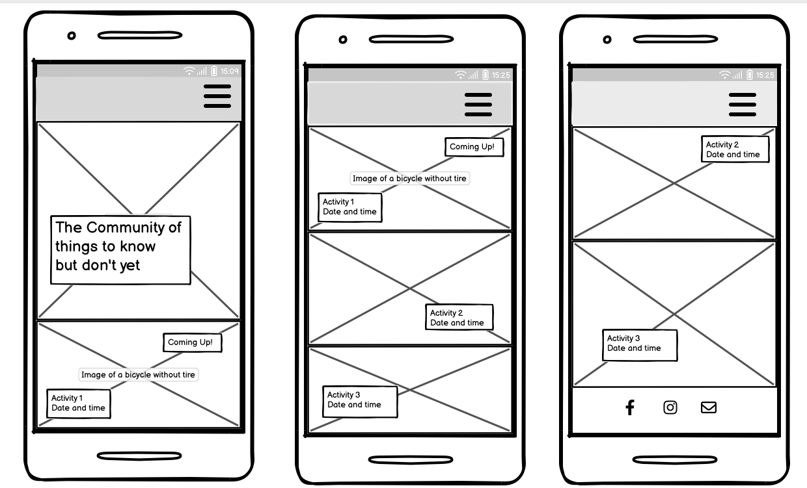
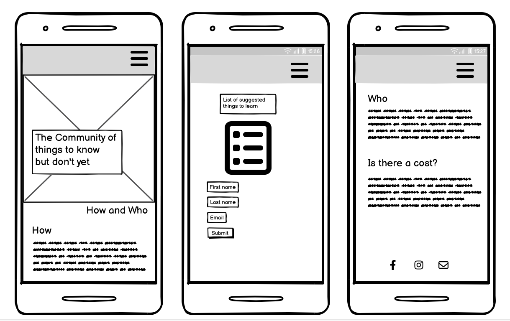
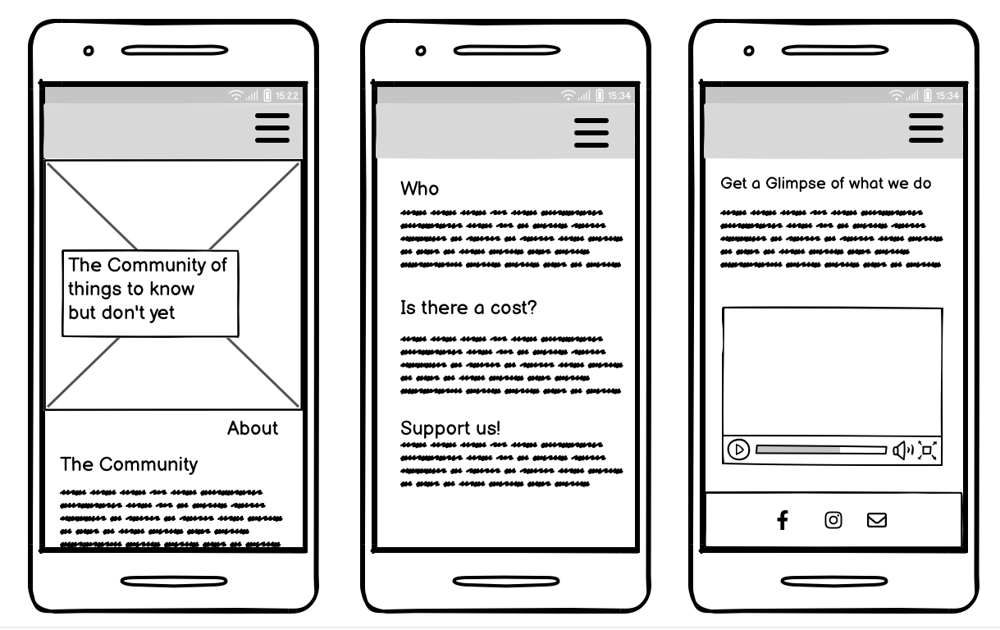
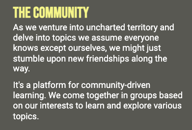
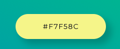
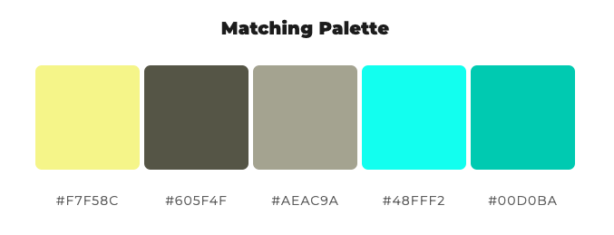
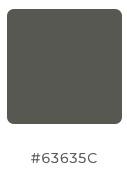
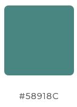

# The Community of Things You Want to Know - But Don't Yet
https://aslinedvinsson.github.io/The-community-of-things-to-know-PP1/ 

A website for Connecting, Learning, and Building Friendships Together.

## Introduction
The "Community of Things You Want to Know But Don't Yet" is a website that offers the opportunity to join a community of learners. We focus on acquiring skills or knowledge that many of us may feel we should already know but, for various reasons, haven't learned yet.

You might wonder, 'Why not just Google it or search on YouTube?' While those resources are certainly available, what we've discovered is that people crave real-life connections. Studies have shown that, despite the digital age, young people are feeling lonelier than ever. Beyond acquiring new skills, our platform provides an avenue to make new friends.

This site caters to individuals who are eager to learn, make new connections, and find friendship. We, as a community, propose learning activities and encourage users to let us know which activities they're interested in. Additionally, we welcome suggestions for new learning ideas. When there's enough interest in a particular activity, the community organize a two-hour meetup where participants can learn the new skill together.

Users can also join our Facebook group, follow our community on Instagram, and contact us via email to stay connected and engaged.

## Design of the website
#### Landingpage Home
The website features a simple three-page design, with the most engaging information showcased on the landing page. This includes upcoming learning activities that pique users' interest.

The landing page serves as the focal point for attracting interest in the community. It showcases appealing images of people engaging in various activities such as repairing a bicycle, sewing on a machine, and cooking dinner. These images exemplify the diverse range of skills users can learn through the Community.

The landing page also prominently displays a "Coming Up!" section, featuring planned learning sessions. Each activity is presented within dark squares with white text, providing a headline activity, time, and date.

#### How and Who Page:
The "How and Who" page features an image of a welder, aiming to further pique users' interest. Below, a section explains the process: it's a meetup in Gothenburg where users can express interest in learning activities. When a sufficient number of people express interest, the Community arranges a learning session. Users can indicate their preferences by ticking boxes for the topics they want to explore. To submit their interests, users are prompted to provide their first name, last name, and email.

The "Who"section assures users that everyone is welcome, as long as they are friendly and open-minded.

Additionally, there's a "Cost" section that informs users about the Community's goal to offer learning activities free of charge. However, it acknowledges that there may be instances where experts need to be enlisted, potentially incurring costs. The Community encourages users to reach out if they are unable to pay, with the commitment to finding solutions to ensure everyone can participate.

#### About Page:
The "About" page features an image of three individuals engaged in conversation, exuding a friendly and welcoming atmosphere. This image conveys the message that building new friendships is another objective of the Community. Beneath the image, a text explains the Community's aims: to learn new things together and forge new friendships.

"Support Us!" section which we provide two meaningful ways to support the Community—through financial contributions and volunteering. 

Additionally, there is a "Get a glimpse of what we do" section. In this section, we offer you a firsthand look at our community's activities by featuring an embedded video as an illustrative example of what we're all about.

### Wireframes
**Mobile first wireframes**
The website was designed with a mobile-first approach, as it is the standard practice.

**Landing page**

**The How and Who page**

**The About page**

**Landing page wide screen**

### Fonts
**Bebas Neue:** The uppercase, sans-serif font Bebas Neue is employed for the logo and headings. It is a font that exudes a youthful and modern impression, making it particularly suitable for headlines. Bebas Neue Designed by Ryoichi Tsunekawa.

**Roboto:** For the remaining text, we use Roboto as the font. Roboto is also a sans-serif typeface specifically crafted for on-screen use. It has been meticulously designed to strike a balance between content density and readability. Roboto enjoys widespread adoption and has been extensively tested and utilized. As a web-friendly font, Roboto renders excellently on modern web browsers and maintains performance even on older versions, ensuring the highest quality text display for all users. Roboto
Designed by Christian Robertson.

Both fonts come from [Google Fonts](https://fonts.google.com/).They are sans-serif, and the backup font is also set to sans-serif.

Example showing Bebas Neue as a headline and Roboto as paragraph text

### Color Scheme

The color theme has evolved over time, initially featuring very bright colors and transitioning to more subdued tones. These subtler shades continue to convey a youthful, energetic, and joyful message. The chosen colors also harmonize effectively with the selected images. The starting point for the color scheme was a lighter shade of yellow.

 
[Mycolor Space](https://mycolor.space/?hex=%23F7F58C&sub=1) was then used to create a matching palette. 

The background color and the color of the footer had to be darkened to meet accessibility standards. The updated colors are shown below.

 

The colors of the social media icons were selected for their recognizability, as they match the original colors of Facebook and Instagram. [Lockedown SEO](https://www.lockedownseo.com/social-media-colors/) provided the information about the colors of social media icons.

| Color             | Hex   |
| ----------------- | ------|
| Navbar and Logo| #F7F58C |
| Navbar toggle|  #FEAB9A |
| Navbar icon|  #63635c  |
| Background|  #63635c |
| Footer| #58918c|
| Social media icon| #1877f2 |
| Social media icon| #c32aa3 |
| Email icon| #FFFFFF |
| Text| #FFFFFF |

### Images
Images are sourced from [Unsplash](https://unsplash.com/), resized, and cropped to fit the website's design. The photographers are appropriately credited in the credit section.

### Text
All text is written by the maker of the website. 

## Existing Features
### Navigation bar
All three pages incorporate a header with a navigation bar. The navigation bar allows users to easily navigate between sections without needing to return to the landing page. The navigation bar is fully responsive, featuring a hamburger icon (three stripes) on mobile devices and horizontally displayed links to the three main pages on wider screens. These links include "Home", "How and Who" and "About." The currently selected page is indicated with an underline. When users hover over the links, they change color to pink, enhancing accessibility and facilitating navigation. 

### Footer
A footer is present on all pages, housing social media icons for Facebook and Instagram, as well as an email contact icon. The footer also contains a brief message stating that the Community of Things to Know is a registered non-profit organization, emphasizing that all donations are tax-deductible, and featuring a copyright notice. The responsive design of the footer ensures that the icons shift from the top center to the right on wider screens.

### Video
The "About" page includes a YouTube video to provide users with a glimpse of the community's activities. This video is sourced from [The Susberg](https://www.youtube.com/watch?v=wO5vN3SFXnw), with additional details available in the credit section. [The Fast YouTube Embedder](https://tube.rvere.com/) was used to enhance website loading times, as videos can slow down the site's performance.

### Form for Learning Activities and Submission Function
The "How and Who" page presents a list of suggested learning activities with checkboxes, enabling users to select their preferences or propose new learning ideas. Below the activity list, a submission form requests users to provide their first name, last name, and email. Clicking the submit button directs users to https://show.ratufa.io/form, where they can review the data they've entered.

### Future Features

#### Advanced Calendar with Signup Functionality
An advanced calendar system that offers users the capability to sign up for already scheduled learning activities. This calendar not only displays upcoming events but also indicates the number of available spots for each activity.

#### Database for User Learning Preferences and Contact Information
To streamline the process and enhance user experience, a database can be integrated to store user preferences for what they would like to learn, along with their contact information. This database enables us to better organize and coordinate learning sessions based on user interests and ensures efficient communication with our community members.

## Languages
The website is created with HTML(Hypertext Markup Language) together with CSS (Cascading Style Sheet).

## Technologies Used

- [Balsamiq](https://balsamiq.com/) was used to create the wireframes.
- [Google Fonts](https://fonts.google.com/) was used for the fonts: Roboto and Bebas Neue.
- [Fontawesome](https://fontawesome.com/) was used for the social media icons.
- [Simple image resizer ](https://www.simpleimageresizer.com/) was used to resize the images.
- [Img tools](https://www.imgtools.co/) was used for cropping images.
- [Cloudconvert](https://cloudconvert.com/webp-converter) was used to convert image files to .webp format. 
- [Dirty Markup](https://www.10bestdesign.com/dirtymarkup/) was used to clean code.  

## Testing
[HTML Validator](https://validator.w3.org/) and [CSS Validator](https://jigsaw.w3.org/css-validator/) was used to detect syntax errors, which were then fixed. 

[Google Lighthouse](https://chrome.google.com/webstore/detail/lighthouse/blipmdconlkpinefehnmjammfjpmpbjk?hl=sv) in Crome Developer Tools was used to test performance, accessibility, best practice and SEO. Lighthouse detected performance issues and accessibility issues which were corrected to fulfill the 90-100% criteria.

All links, forms and hover functions were tested manually. 

The website has been designed with a mobile-first approach, and during the development process, media queries and Flexbox have been utilized to ensure responsiveness across various screen sizes.

In addition, the website has undergone testing on popular web browsers such as Chrome, Mozilla Firefox, and Safari. While in some cases, there may be slight variations in the appearance of text, the overall functionality and user experience are ensured to remain consistent across these browsers.

## Unfixed Bugs
The identified bugs were resolved.

## Deployment
The site is deployed at GitHub as follows:
On the GitHub repository, go to Settings/Pages and set the default branch to Main. When the branch is selected the page will display a deployment and the link address. 

The live site is found here https://aslinedvinsson.github.io/The-community-of-things-to-know-PP1/ 
